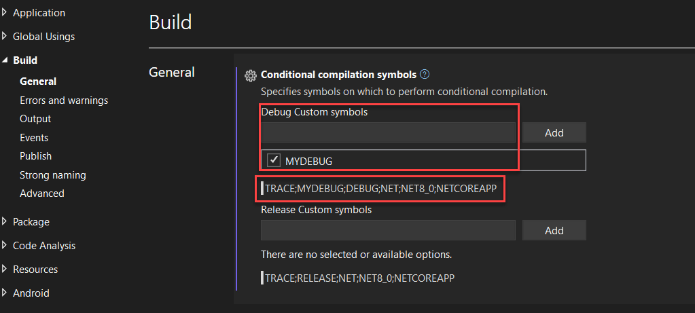

# Conditional compilation

MonoGame supports running C# projects on multiple platforms and supports several [directives](https://docs.microsoft.com/en-us/dotnet/csharp/language-reference/preprocessor-directives) to allow developers to selectively include or exclude code from compilation, based on whether certain [scripting symbols](https://learn.microsoft.com/en-us/dotnet/core/diagnostics/symbols) or definitions are defined or not defined.

You can read more broadly about how these directives work in C# in Microsoft’s user documentation on [C# preprocessor directives](https://docs.microsoft.com/en-us/dotnet/csharp/language-reference/preprocessor-directives)

The hash `#` character in front of the **if** and **endif** indicates that these statements are “directives”, and they are handled during the build/compilation process, rather than at runtime.

As an example, you can see in the code excerpt below, one set of code will be compiled on a DesktopGL platform, else the other code will be used.

```csharp
#if DESKTOPGL
    // The Client is running on the DesktopGL runtime
#else
    // The Client is NOT running on DesktopGL
#endif
```

The critical factor is that the above pattern reduces what code is compiled and is included in the final build / release.

> [!NOTE]
> The above technique is an alternative to using the `MonoGamePlatform` method, where all code included is compiled and included in your build, for example:
>
> ```csharp
> if(PlatformInfo.MonoGamePlatform == MonoGamePlatform.DesktopGL)
> {
>     // The Client is running on the DesktopGL runtime
> }
> else
> {
>     // The Client is NOT running on DesktopGL
> }
> ```

## Platform scripting symbols

MonoGame provides the following scripting symbols through the [PlatformInfo](https://github.com/MonoGame/MonoGame/blob/develop/MonoGame.Framework/Utilities/PlatformInfo.cs) class, these are as follows:

|Scripting #define|Description|Notes|
|-|-|-|
|ANDROID|Defines an application running on an Android system, this includes all Android based systems and varients.||
|DESKTOPGL|A collective defintion covering OpenGL graphics on Windows, Mac and Linux.||
|IOS|Covers all iOS based devices, including iPhone, iPad and future systems based on iOS.||
|TVOS|Specific target for TVOS only.||
|WINDOWS && DIRECTX|Combined definition for using DirectX on a Windows runtime|If you are using OpenGL, then use the DESKTOPGL define.|
|WINDOWS_UAP|Targetting Windows 10 & 11 UWP based applications||
|SWITCH|Nintendo Switch based platform only.||
|XB1|Xbox One, all editions. Including Xbox One, Xbox One X & S, Xbox Series X&S||
|PLAYSTATION4|Playstation 4 custom silicon platform, for all editions of Playstation 4 including Pro||
|PLAYSTATION5|Playstation 5 AMD based platform, for all editions||
|STADIA|Google Statia runtime|Being deprecated with the fall of Stadia|

## Other scripting symbols

Microsoft Build which is used under the hood to build MonoGame projects also provides the following default symbols (as well as those included in your projects definition):

|Scripting #define|Description|Notes|
|-|-|-|
|TRACE|||
|DEBUG|Is the application running in a DEBUG mode.||
|RELEASE|Is the application running in a RELEASE mode.||
|NET|Defines an application running on .NET.||
|NETX|A define for the specific version of .NET being used, usually NET6 (.net 6) or NET8 (.net 8).||
|NETCOREAPP|Defines an appication running as a .NET Core Application.||

To see the default symbols defined for your project:

# [VSCode](#tab/vscode)

In your `project.csproj` file, you can add custom symbols to your project as shown below.  TRACE, DEBUG, RELEASE and framework options are included by default.

The below example adds a `MYDEBUG` symbol in `Debug` build profile.

```xml
  <PropertyGroup Condition="'$(Configuration)|$(Platform)'=='Debug|AnyCPU'">
    <DefineConstants>$(DefineConstants);MYDEBUG</DefineConstants>
  </PropertyGroup>
```

# [Visual Studio](#tab/vs)

In Visual Studio, you can right-click your project and select properties to view your project definition, navigating down to the `Build` tab shows the symbol options for your project.



---

## Testing precompiled code

The example below shows logging the specific platform that was detected on startup.

```csharp
using Microsoft.Xna.Framework;
using Microsoft.Xna.Framework.Graphics;
using Microsoft.Xna.Framework.Input;
using MonoGame.Framework.Utilities;
using System;

namespace MonoGameDefinitionsTest;

public class Game1 : Game
{
    private SpriteBatch _spriteBatch;

    public Game1()
    {
        _graphics = new GraphicsDeviceManager(this);
        Content.RootDirectory = "Content";
#if DESKTOPGL
        Console.WriteLine("Hello from DesktopGL");
#elif ANDROID
        Console.WriteLine("Hello from ANDROID");
#elif IOS
        Console.WriteLine("Hello from iOS");
#elif WINDOWS && DIRECTX
        Console.WriteLine("Hello from WindowsDX");
#else
        // Fallback for any platform that was not selected above.
        Console.WriteLine($"Hello from {PlatformInfo.MonoGamePlatform}");
#endif
    }
}
```

Depending on whichever platform you `Compile` for (build), only the specific lines detected above will be included in the build.