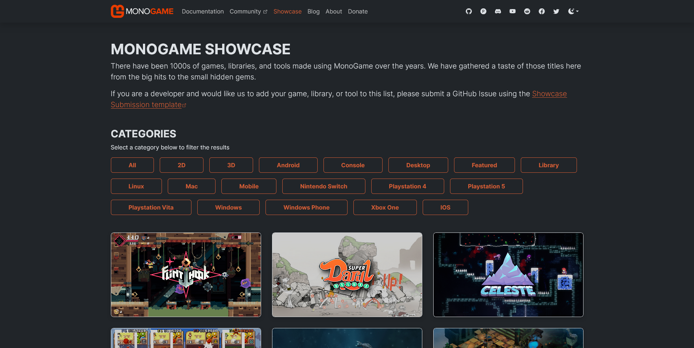
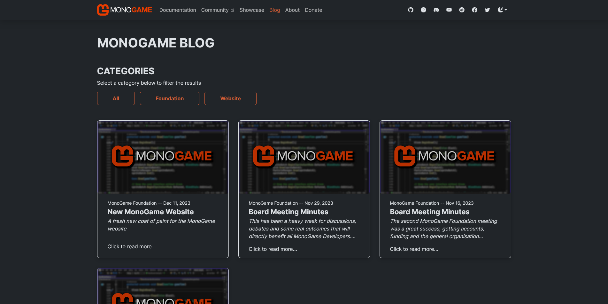
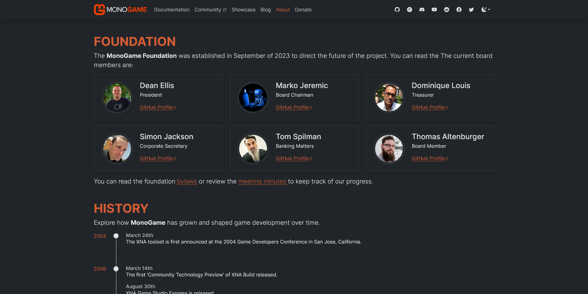
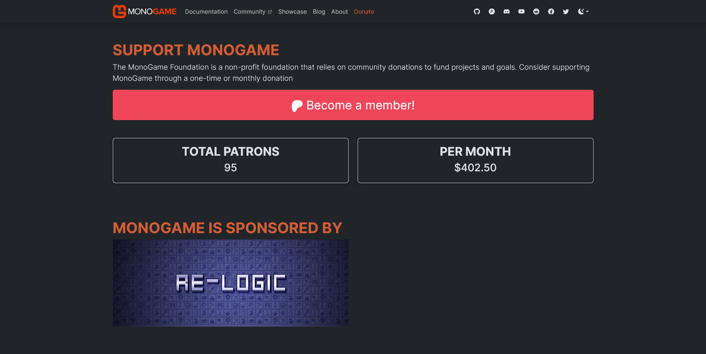
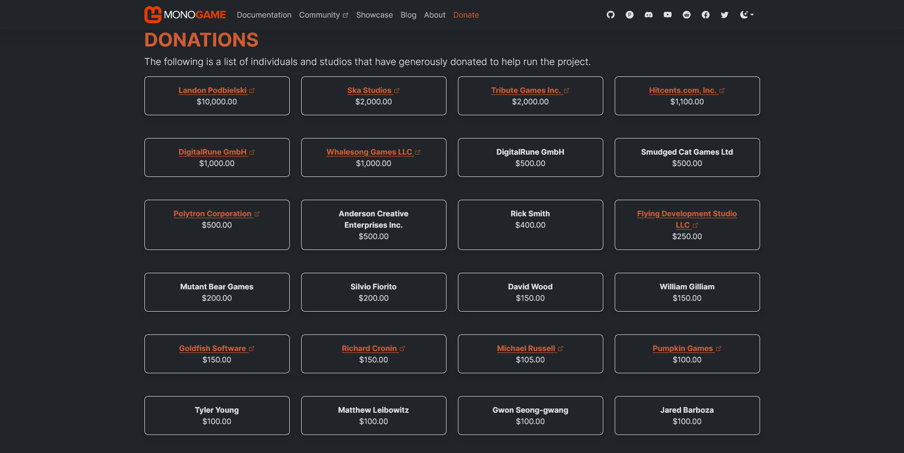
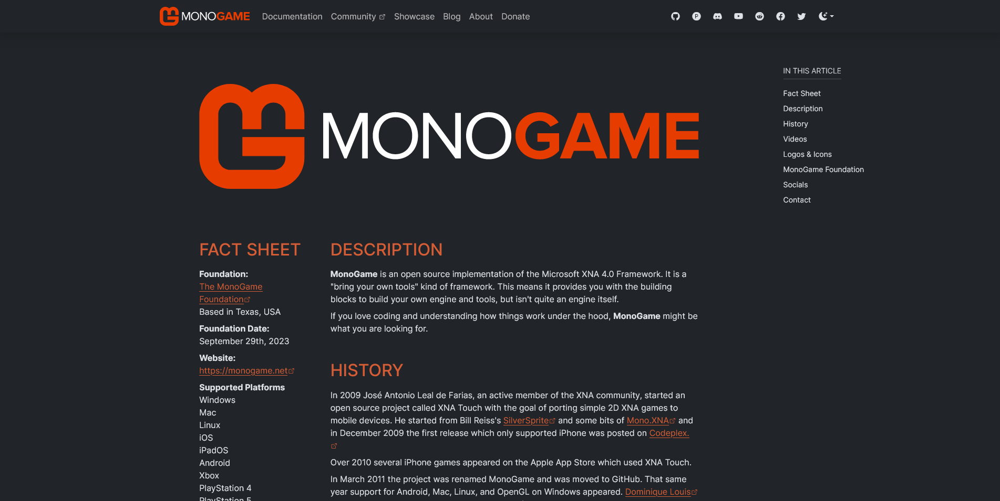

## Website Refresh

Several new changes have been made to the website in this proof of concept by changing to 11ty to allow for a more proper website design than the restrictions in place when using DocFX.  In this post, I'd like to go over these changes with you and, hopefully, get some feedback from community members on [Discord](https://discord.gg/monogame). 

## Maintenance

This is the elephant in the room, so let's get it out of the way first.  In terms of maintenance for both the MonoGame Foundation and community members that would like to contribute to the website, moving it to 11ty does not add any additional maintenance.  Everything has been pre-setup and is ready to go, no different than what you would have if you used only DocFX.  The difference now is that *if* you needed to adjust how something internally is done **you can**.  

Care was put into making this proof of concept so that visually the documentation pages are similar to that created by DocFX in terms of styling.  DocFX is still used as the backend mechanism for generating the API documentation pages.

For other pages, foundation and community members only need to worry with writing Markdown files as usual, same with DocFX.  Articles are just markdown files, blog posts are just markdown files.  There's no additional maintenance overhead that needs to be managed or learned.  

## Showcase

The showcase page has been updated to allow for better filtering of items through the pagination system within 11ty. By making use of the [games.json](https://github.com/AristurtleDev/monogame-11ty/blob/main/_data/games.json) data and the pagination system in the [showcase.njk](https://github.com/AristurtleDev/monogame-11ty/blob/main/content/showcase.njk) template, individual pages are able to be generated for each filter.  This allows for "pretty" urls such as `https://monogame.net/showcase/2d` vs queried url's such as `https://monogame.net/showcase?2d`.  

The showcase gallery is still randomized using the original randomization function written by [Jake Kirkbride](https://github.com/JakeLegendXIII).  

The gallery items have also been updated to use the new `mg-card` class to give a consistent styling that's used throughout on various other pages as we'll see.  This allows for brightness transitions when moving the mouse over a gallery item to highlight it as the selection.  



## Blog

As mentioned in the [README.md](https://github.com/AristurtleDev/monogame-11ty/blob/main/README.md), we can now take advantage of 11ty's pagination feature to create a blog section for the MonoGame Foundation.  This can be used to post news on the foundation such as board meeting minutes or news on the MonoGame project such as new releases.  It gives single place of source to get all official news from the foundation concerning MonoGame. 

Blog posts can be categorized using tags and filtered on the main site using the tags.



## About Page

The about page has been updated to feature a more card style approach to listing the foundation members.  The History timeline was also updated to have a dashed bar between events to give it more of a timeline fill than just a list of data.



## Donate Page

A new [Donate](https://mgdocs.aristurtle.net/donate) page has been added which contains information on how they can donate to the MonoGame Foundation via Patreon. The page also uses the Patreon API to pull in the current total patrons and monthly amount. 

Further, it shows the sponsorship accreditation from Re-Logic as well as brings back the old donation table of past donors.




## Press Kit

Finally, a new [Press Kit](https://mgdocs.aristurtle.net/presskit) page has been added.  Press kit pages are vital one stop pages for media and journalist to quickly gather pre-approved descriptions and facts concerning MonoGame and the MonoGame foundation as well as find images and logos that can be used in articles.  

The press kit page design is based on the [presskit()](https://dopresskit.com/) design by [Rami Ismail](https://twitter.com/tha_rami)



## Other Things of Note

Some of the changes are more behind the scenes things like being able to have consistency across the css styling for various things since we're not also fighting the built in DocFX styling.

Custom admonitions have also been added that can be used in any markdown file. The following is a list of each one added:

::: note Note Title
This is a simple note
:::

::: tip Useful Tip
A useful tip that the reader may need to know about.
:::

::: info Additional Information
Additional information that can be supplied to the reader.
:::

::: warning Warning
A warning that can be given concerning the current topic the reader is reading about.
:::

::: danger Danger
Danger that needs to be conveyed concerning a topic.
:::

The code for using the admonitions is like this

```
::: note Note Title
This is a simple note
:::

::: tip Useful Tip
A useful tip that the reader may need to know about.
:::

::: info Additional Information
Additional information that can be supplied to the reader.
:::

::: warning Warning
A warning that can be given concerning the current topic the reader is reading about.
:::

::: danger Danger
Danger that needs to be conveyed concerning a topic.
:::
```

That's all I can think of for now. Also I'm really hungry and I'd like to stop typing to go get some food now.  Let me know what you think, shoot me some feedback on [Discord](https://discord.gg/monogame).

- Chris Whitley (Aristurtle)
