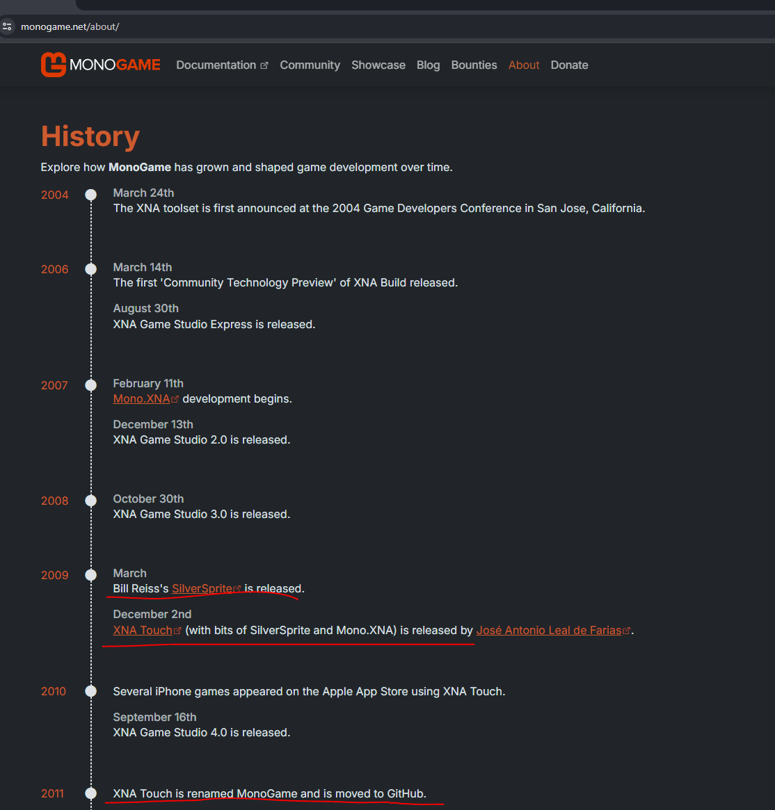

## A dear farewell to Bill Reiss

It is with deep sadness we learned this month (August 2024) of the passing of a long-time Friend of XNA and MonoGame [**Bill Reiss**](https://everloved.com/life-of/william-reiss-1969/).

In his time as a [Microsoft MVP](https://web.archive.org/web/20130705015524/http://mvp.microsoft.com/en-us/mvp/Bill%20Reiss-38348) and firm supporter of Game Development,  Windows Development, Windows Phone and of course Silverlight, Bill, like most MVP's was out there blogging, helping and promoting everything to enable all developers to have a great experience with evolving technologies.

Like so many of us, Bill was very passionate about tech, [even blogging into 2024](http://billreiss.com/) on Windows Development and Maui, even promising to make moves on AI and Machine learning like so many of us (we would have loved to hear his views).  Although sadly it seems "something" must have happened to Bill's blog back in 2019, although the [Internet Archive](https://web.archive.org/web/20130723070311/https://www.billreiss.com/) has captured a lot of what came before.

## Bill Reiss's involvement with MonoGame

As you can see, Bill was influential in the forming of MonoGame and contributing some key components to its construction, like so many of us, seeing the writing on the wall with the termination of Silverlight, Windows Phone and XNA, and looking to keep the dream alive of easy game development in C# to as many platforms as possible.

## Always active

Bill was always "out there" for as long as we knew him, [hosting events](https://www.developerfusion.com/event/134691/bill-reiss-third-annual-xna-game-camp-and-hackathon/) and getting information out there in [Books](https://www.amazon.co.uk/Hello-Silverlight-Bill-Reiss/dp/1933988533) and [Blogs on Microsoft](https://blogs.windows.com/devices/2013/12/06/start-screen-nokia-developer-ambassador-bill-reiss/).

He was always happy to help and chat to work through any issues developers might have on their journey.

## So long and thanks for all the Fish

If you wish to give thanks to Bill, and his family or make a donation, you can find more on [Bill Reiss - Everloved](https://everloved.com/life-of/william-reiss-1969/).

The MonoGame Foundation team
