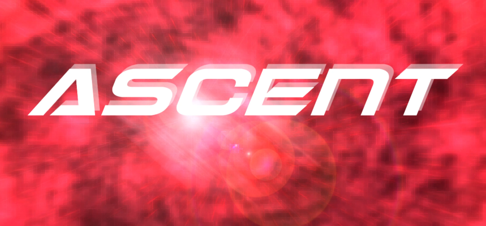
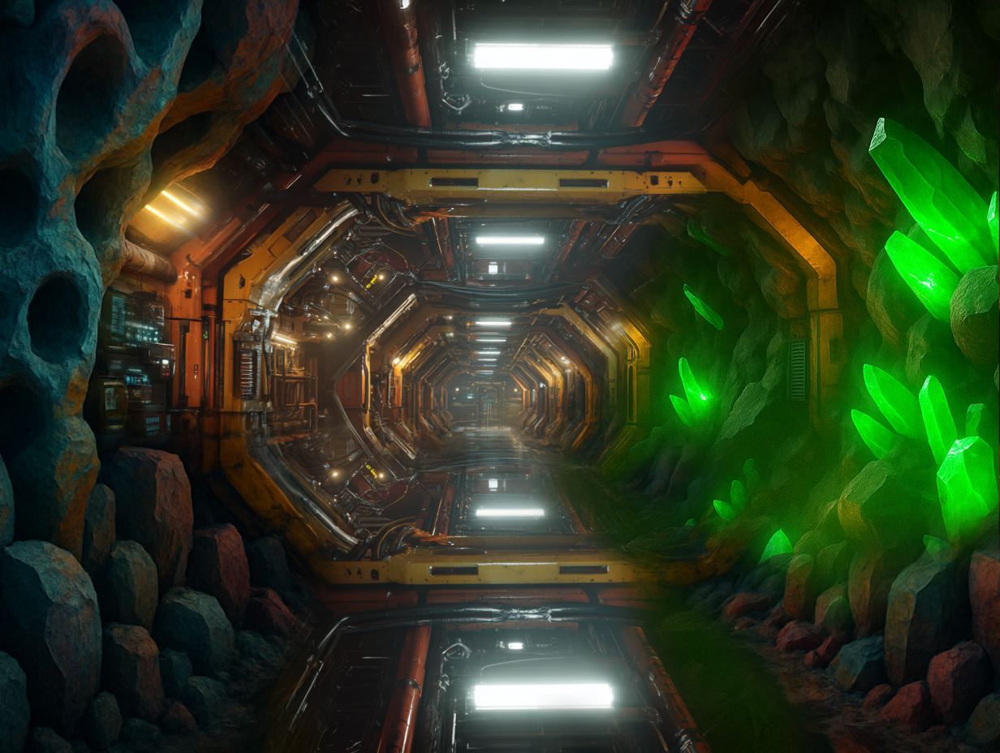
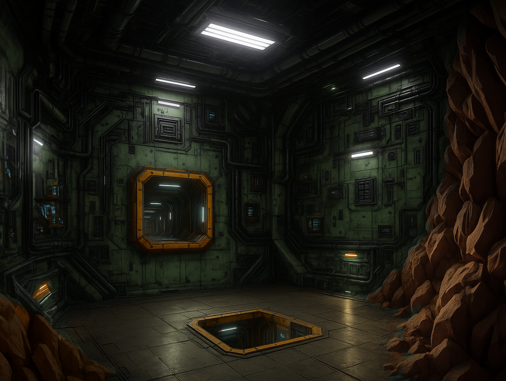

## Ascent Demo

The Ascent Demo is a fully featured project ported from XNA's original [Ship Game](https://github.com/MonoGame/MonoGame.Samples/tree/3.8.4/ShipGame) sample, fully modernized for todays architecture, best-practices and tools.

### What to expect

The primary focus with the new Starter-kit / demo, was to completely refresh the visuals, making it look like a more modern titles that could compete today, have a look:

|||
|:-:|:-:|

But that is not all, most systems are being re-engineered and overhauled, including:

* Advanced rendering techniques
* 3D Sound
* A 3D Level Editor
* New enemies and AI
* BPU Physics Integration
* A 3D GPU based particle system
* Targetting the new Modern Vulkan / DX 12 platforms (Console ready)

And who knows what else the team has in store.

### How to get access

Access for the time being is being provided to contributors at the "DrawUserPrimitives" level or above via :

|[ GitHub](https://github.com/sponsors/MonoGame)|[ Patreon](https://www.patreon.com/bePatron?u=3142012)|[ PayPal](https://www.patreon.com/bePatron?u=3142012)|
|:-:|:-:|:-:|

::: tip More info
For more details about donating to MonoGame, check out the [Donations Page](https://monogame.net/donate/).  We welcome any and all support to continue to support MonoGame.
:::

Early access to the sample grants you more that just the sample itself, you will also get:

* Source access, viewing all the changes as they happen.
* Access to the Sample discord channel to discuss the sample with the team.
* Help shape the 3D sample to be the best it can be.
* Early access to all the source material, assets and textures.

The sample will eventually be released for all freely in due time, once the solution is complete.

## On with the show

This is the first of what we hope will be many advanced and new samples, as well as the new tutorials that will be hitting soon, including:

* 3D Starter sample
* 2D Advanced Shaders
* Mobile production and delivery (based on the 2D tutorial)
* Networking sample (based on the 2D tutorial)

The Foundation is working hard to ensure everyone gets the best experience they can from MonoGame, which we can only do with your help and support!.


