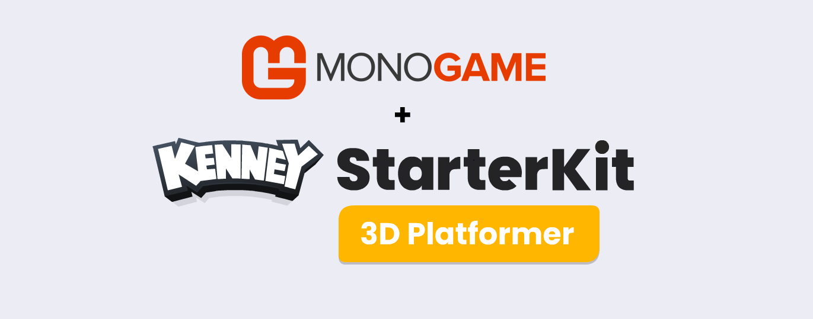
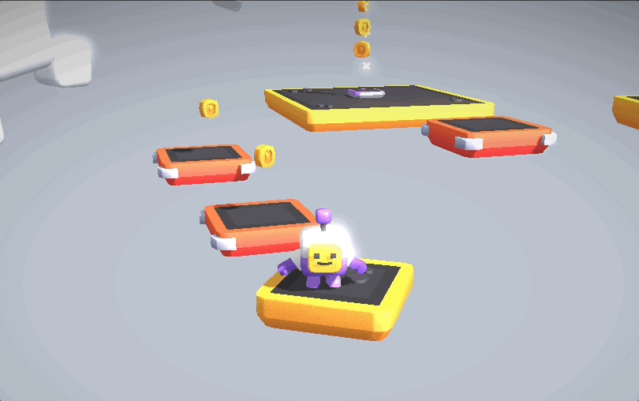
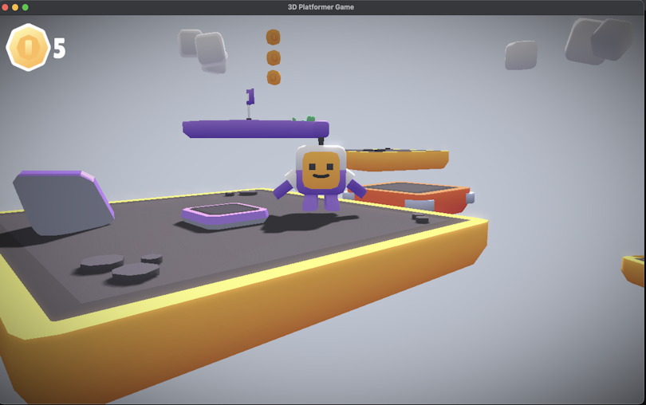

## 3D Platformer Starter Kit

This is a pure MonoGame port of the [original](https://github.com/KenneyNL/Starter-Kit-3D-Platformer) that was written by [Kenney](https://www.kenney.nl/starter-kits) for Godot 4.3 (stable).
All the assets are the same, we just decided to port this from Godot to MonoGame.

### What to expect

The primary focus with the new Starter-kit / demo, was to create a simple, easy to follow,
example of making a 3D Game using MonoGame.

|||
|:-:|:-:|

But that is not all, it includes features like;

- Character controller (with double jump)
- Collectable coins and falling platforms
- Camera controls (rotate, zoom)
- Gamepad support
- Basic Convex Hull Collision System
- Uses Blender for Level Editing
- Sprites and 3D Models _(CC0 licensed)_
- Sound effects _(CC0 licensed)_

And we will continue to update it before it goes public.

### How to get access

Access for the time being is being provided to contributors at the "SpriteBatch" level or above via :

|[ GitHub](https://github.com/sponsors/MonoGame)|[ Patreon](https://www.patreon.com/bePatron?u=3142012)|[ PayPal](https://www.patreon.com/bePatron?u=3142012)|
|:-:|:-:|:-:|

::: tip More info
For more details about donating to MonoGame, check out the [Donations Page](https://monogame.net/donate/).  We welcome any and all support to continue to support MonoGame.
:::

Early access to the sample grants you more that just the sample itself, you will also get:

* Source access, viewing all the changes as they happen.
* Access to the Sample discord channel to discuss the sample with the team.
* Help shape the 3D sample to be the best it can be.
* Early access to all the source material, assets and textures.

The kit will eventually be released for all freely in due time, once the solution is complete.

## On with the show

This is the second of our new examples/kits, as well as the new tutorials that will be hitting soon, including:

* 2D Advanced Shaders
* Mobile production and delivery (based on the 2D tutorial)
* Networking sample (based on the 2D tutorial)

The Foundation is working hard to ensure everyone gets the best experience they can from MonoGame, which we can only do with your help and support!.


