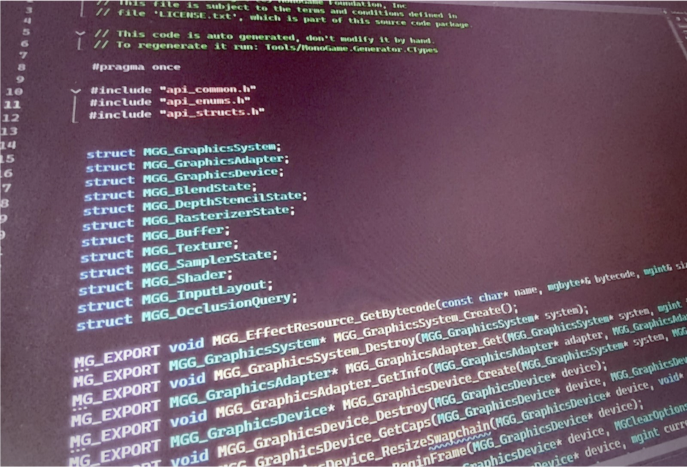
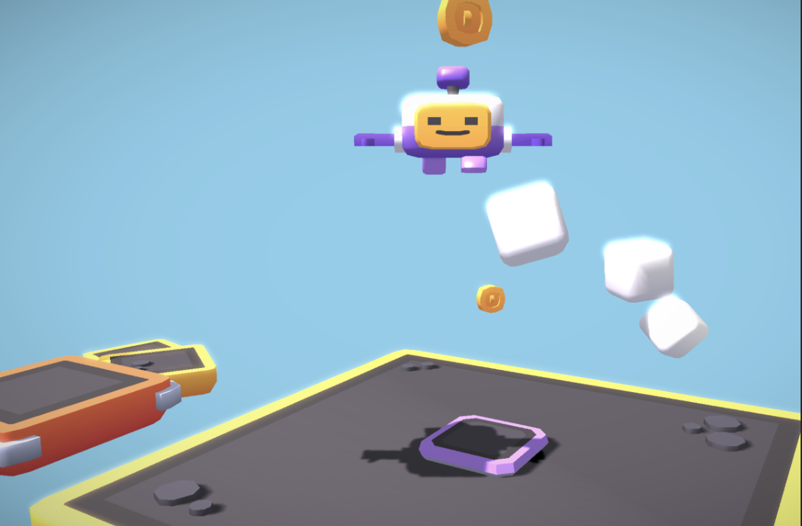
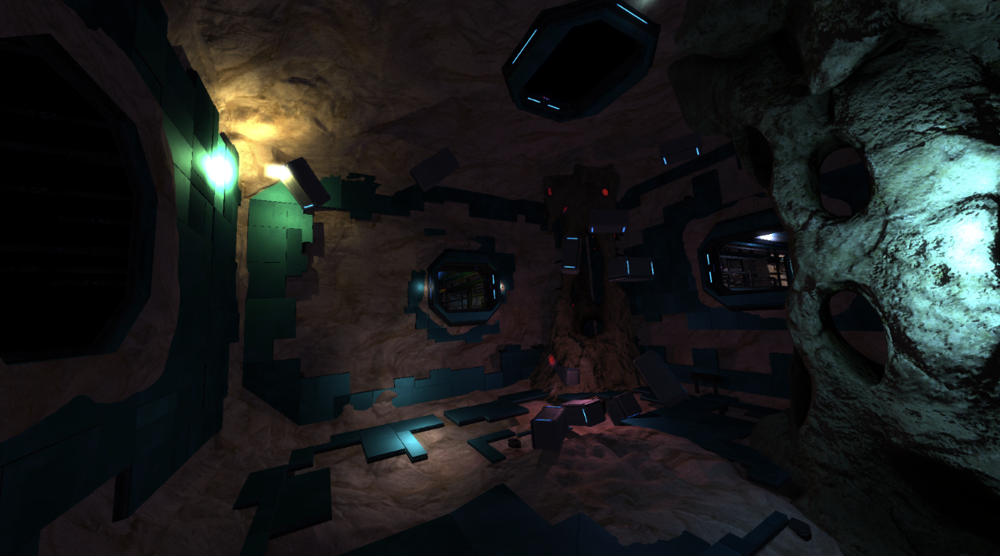
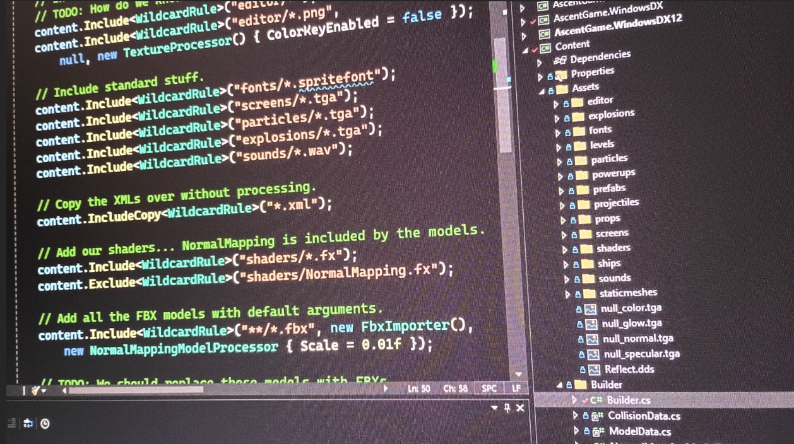

# The 3.8.5 Release

We’re happy to announce the release of the long-awaited 3.8.5 release of the MonoGame Framework. 

Here are the highlights of some of the bigger changes in this major release: 

## New Native Backend 

For most of the history of MonoGame we’ve used various 3rd party C# wrappers to access native platform features. 

This started with the adoption of OpenTK to provide OpenGL support in early releases of the framework.  This was followed by SharpDX for DirectX 11 and various other libraries when we needed a feature that we did not want to write about ourselves.  This was also true in the content pipeline. 

We have ballooned to almost a dozen different references between the runtime and the content pipeline, which has made our dependencies complex.  Worse, when we ran into issues with these libraries, it made bugs more difficult to fix.  This required submitting fixes to upstream projects and waiting for our fixes to be adopted, and slowed down releases, with less control over the quality of the framework.  We started trying to manage our own forks of these libraries and even wrote our own OpenGL pinvokes, but it felt like more work than it should be. 
 
 

Inspired by our console support, we have begun to move to a single native (C/C++) dynamic library.   This native library provides all the platform specific implementations, and the C# side of the framework can remain platform independent.  This means we have almost no per-platform C# code and can share lots of native code implementations across our target platforms. 

We are now transitioning our console implementations to this new native backend, using bits of it for the content pipeline, and in the new target platforms we have added in this release. 

## New DesktopVK Target 

Part of the new native backend is a new target platform:  DesktopVK.  



Our intent is for this to eventually replace our DesktopGL platform with a single target build that supports Windows, Mac, and Linux desktop platforms. This implementation uses SDL2, Vulkan, and FAudio to get maximum compatibility across these platforms. 

The Vulkan implementation was code that was originally developed for Google Stadia and adapted to our new native backend graphics API.  It runs just about as fast as our existing target platforms in this first release.  We expect this will further improve over the next few years as it replaces DesktopGL. 

## New WindowsDX12 Target 

Another new target platform is Windows DirectX 12. 



The new Direct3D 12 implementation was created as a bounty for Xbox One and Xbox Series support.  We have since modified and improved this to fit the new native backend.  It also uses SDL2 for input and window management on PC but goes with XAudio2 for sound. 

Since this code is shared with Xbox it means less work for our maintainers and consistent results.  The performance is also nearly the same as our Direct3D 11 implementation, and we expect it to replace it in the coming few years.  

This gives us a new target platform on PC that is Microsoft GDK compatible and can be used in a release on the Microsoft Store or PC Game Pass. 

## Upgrading your projects

If you want to experiment with the new native backends you can replace your existing DesktopGL/WindowsDX `PackageReference` entires in your .csproj with the following.

### DesktopVK

Add a `MonoGamePlatform` property, this tells the Content system which platform you are building for.

```xml
<MonoGamePlatform>DesktopVK</MonoGamePlatform>
```

Then *replace* your existing `DesktopGL` package reference with the following

```xml
<PackageReference Include="MonoGame.Framework.Native" Version="3.8.*" />
<PackageReference Include="MonoGame.Runtime.MacOS.Vulkan" Version="3.8.*" />
<PackageReference Include="MonoGame.Runtime.Linux.Vulkan" Version="3.8.*" />
<PackageReference Include="MonoGame.Runtime.Windows.Vulkan" Version="3.8.*" />
```

### WindowsDX12

Add a `MonoGamePlatform` property, this tells the Content system which platform you are building for.

```xml
<MonoGamePlatform>WindowsDX12</MonoGamePlatform>
```

Then *replace* your existing `WindowsDX` package reference with the following

```xml
<PackageReference Include="MonoGame.Framework.Native" Version="3.8.*" />
<PackageReference Include="MonoGame.Runtime.Windows.DX12" Version="3.8.*" />
```

## New Content Builder 

In 3.8.5 we included the first release of our new Content Builder system. 



This new design is code-centric much like the MonoGame Framework itself.  Instead of a data file with instructions to build your content, you maintain a C# project that references assemblies and builds your content.  Here is a short example: 

```
using Microsoft.Xna.Framework.Content.Pipeline; 

using Microsoft.Xna.Framework.Content.Pipeline.Processors; 

using MonoGame.Framework.Content.Pipeline.Builder; 

  

var builder = new Builder(); 

builder.Run(args); 

return builder.FailedToBuild > 0 ? -1 : 0; 
  

public class Builder : ContentBuilder 

{ 

    public override IContentCollection GetContentCollection() 

    { 

        var content = new ContentCollection(); 

  

        content.Include<WildcardRule>("Effects/*.fx"); 

        content.Include<WildcardRule>("Font/*.spritefont"); 

        content.Include<WildcardRule>("Sounds/*.ogg", new OggImporter(), new SoundEffectProcessor()); 

        content.Include("splash-screen.png"); 

  

        return content; 

    } 

} 
```
 

Our recommended convention is to build this code in a C# console project, that is then executed automatically before running your game project.  However, because this is code based (like any other exe) you can place this anywhere you want, including in a custom editor or embedded in a development build of your game.  This gives you flexibility in how you build and use your tools for your game development workflow.  Essentially, it is a customized content builder pipeline specifically for your project. 

It is early days for this new builder, but we already have plans for more improvements. The team is excited to see your use of the new builder and look forward to your feedback and suggestions. 

## ARM support 

Many platforms are now offering ARM64 based architectures in their hardware, from Windows, Linux and obviously Mac. 

 
As part of the 3.8.5 release, we are shipping both development and runtime packages for ARM systems.   This means you can not only run MonoGame projects on ARM devices, but you can build them on ARM too.  This opens up MonoGame development to even lower powered hardware like the Raspberry Pi 4/5, making this our most accessible release ever. 

## Improvements & Bug Fixes 

Beyond the major additions above, we are delivering a solid batch of core framework improvements and fixes. 

On the feature side, the release includes a new Random implementation, extended GamePad support for up to 8 controllers, and new HSL/HSV color conversion handling, along with new APIs for native texture sharing, additional Color overloads, and additional Matrix operators. We also added a standalone downloadable binary release alongside the usual NuGet packages. 

The release also rolls up a long list of bug fixes, including a fix for games getting stuck in fullscreen, crashes on shutdown when using Song or SoundEffect, Android crash fixes, SpriteFont layout bugs, a drag-and-drop fix, some controller mapping issues, and defaulting to GLES3 when available on mobile. 

Altogether these round out 3.8.5 as a genuine quality-of-life maintenance release, with over 100 other updates since our last release. 

Thanks always to all the developers who contributed to this release, both in and outside the foundation. 

 

## What’s Next 

The team is excited to get moving on 3.8.6.  It will mainly serve as hardening of the new target platforms and long due maintenance tasks that will help the project move forward.  At the same time, we are working on bigger tasks that appear in 3.9 including new font systems, a new unified shader compiler, native mobile platform support, a refreshed save game system, and more. 

## Feedback

Any feedback or questions should be directed to the [MonoGame Discord Forum here](https://discord.com/channels/355231098122272778/1456336483991425065)


