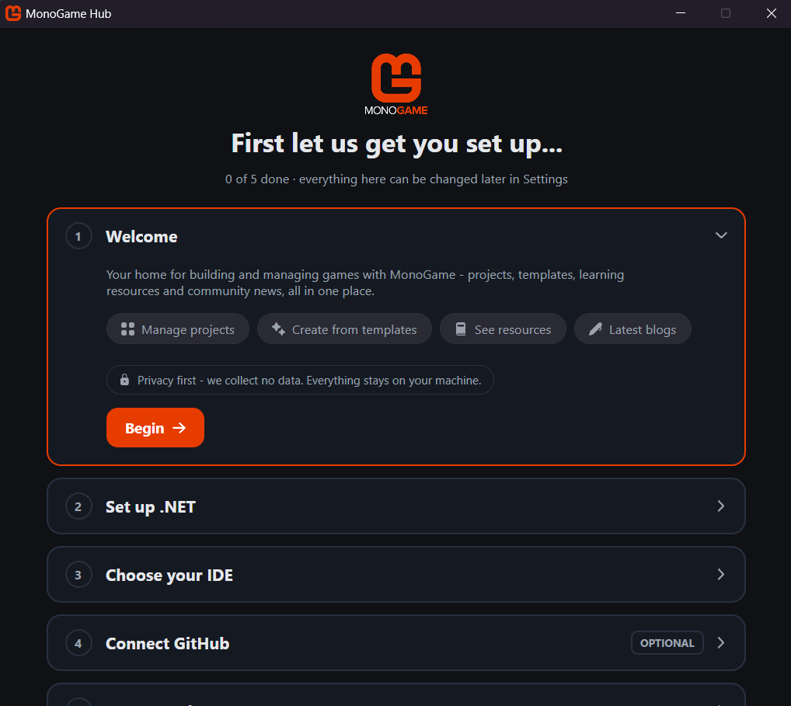
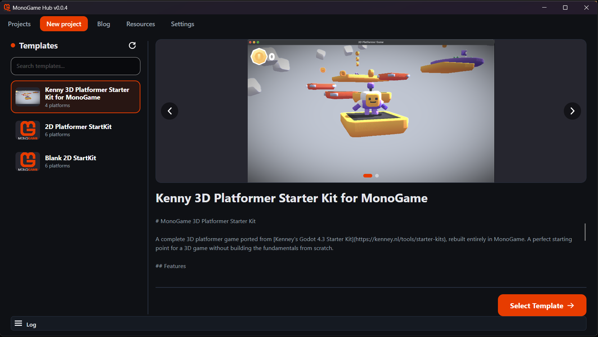
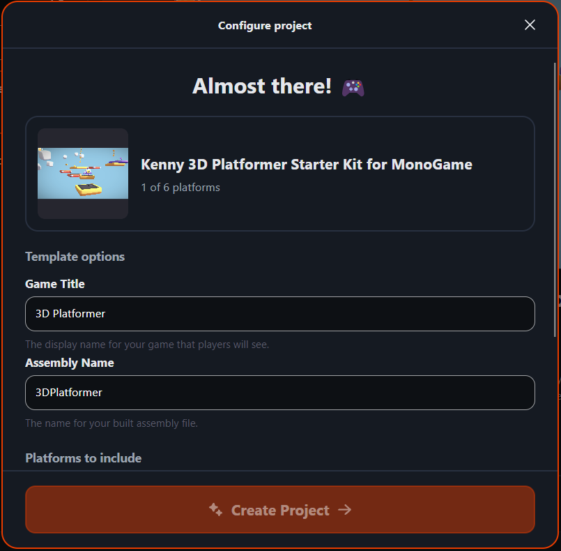
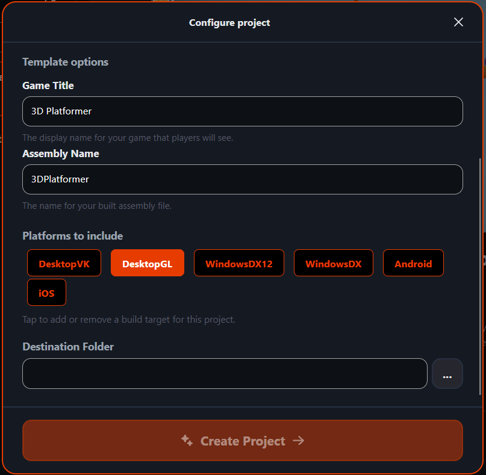
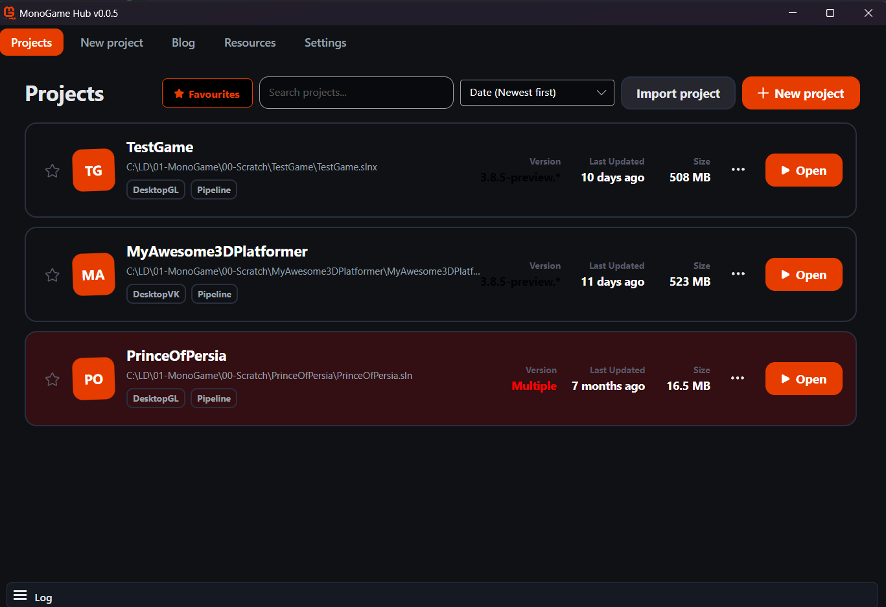
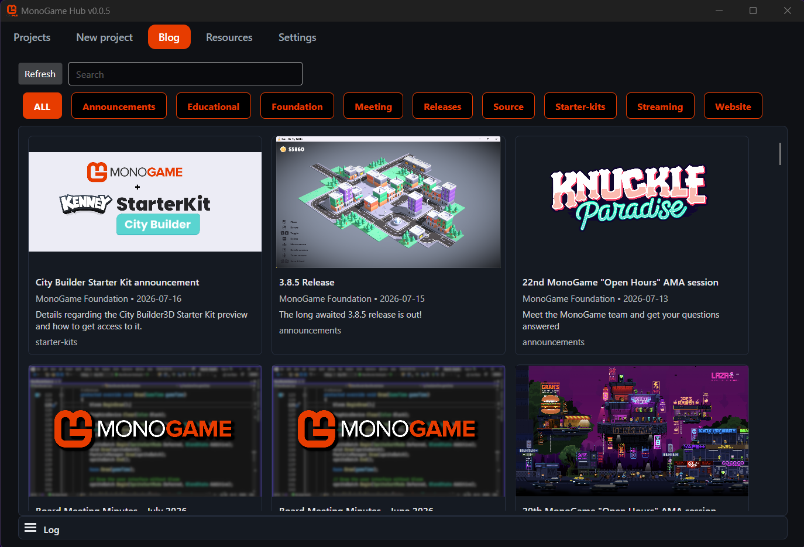
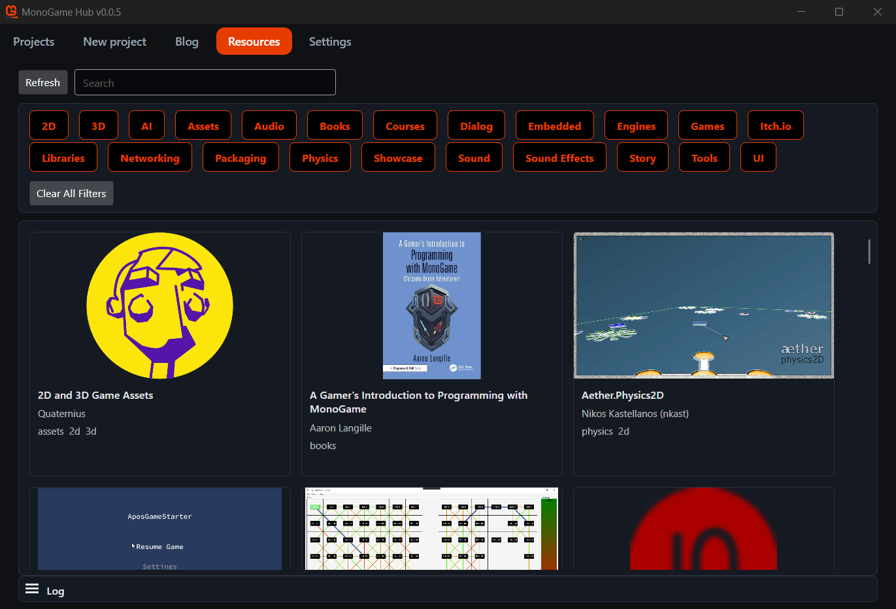

The MonoGame Foundation is proud to announce the development of a new tool aimed at simplifying access to MonoGame project creation and management.

## Enter the MonoGame Hub

The MonoGame Hub is a new tool whose sole purpose in life is to accelerate the creation of MonoGame projects using well-defined templates and simplify the management of your MonoGame project, with some additional flavour built in to see blog posts and available resources in one handy place.

The Hub will offer the following capabilities:

- Surfaces official MonoGame project templates, with capabilities far beyond the simple templates available through DotNet commands today.
- Details more information and highlights of the capabilities of the template prior to generation.  Images/videos/descriptions and so on.
- Solution generation from a template for your selected platforms, allowing you to pick the platforms you want and ignore the ones you do not.
- Lists/Manages a set of registered MonoGame Projects either generated through the Hub or imported from pre-existing projects.
- Lists out the blog posts from the main website, with announcements for new news items when the hub is launched.
- Provides direct access to published resources from the MonoGame website, searchable and filterable via tags.

## The path to development

The dream of the Hub started early in the formation of the MonoGame Foundation to address the numerous issues developers faced when getting started with MonoGame, where despite our best efforts, developers continually hit issues with:

- How do I install MonoGame? (fun fact: there has not been anything to "install" to use MonoGame since `3.8.2`)
- What do I need to install to begin development?
- Where are the sample projects?
- How do I create a new project?

We have built extensive tutorials and getting started guides, all of which improved accessibility but still fell short and left some users guessing as to where to look for more information.

The Hub hopes to address the core reasons these questions exist with a central location/app, **that has no dependencies** to get developers started quicker and surface project templates directly.

## What does this look like?

The current development edition has been kept very streamlined and simple, to focus on the requirements that deliver the most impact:

- Showing what projects you have installed.
- Publishing a list of official templates.
- Simplified project generation, including platform selection
- Resources and blog listings.

Here is what it currently looks like:

### The Startup Wizard

 At startup the Hub checks your development environment and points you to the required resources to get your machine ready, no matter which operating system you are running on:

- Checks you have .NET installed (mandatory, as MonoGame runs on .NET)
- Asks which IDE you wish to use, and pointing you to the download page if it is not yet installed.
- Optionally connects the Hub to your GitHub account, required if you want to access Private/Sponsored content (for sponsors), or your own templates on your own private repositories.

> [!NOTE]
> GitHub connectivity is completely OPTIONAL.
>
> Without a GitHub connection, you will only be able to see public repositories and samples, which is fine.

### Templates/Create view

|  |  |  |
| :-: | :-: | :-: |
| Create Project view | Create Page 1 | Create Page 2 |

From here you can see what templates MonoGame has to offer new projects, from clean slates, to full project samples.  We have plans for more genre starter kits that we will release in the coming months.

### Project List view

The project list shows your game projects created from the Hub as well as ones you imported.   From the list you have quick access to project information as well as quick access to open it in your IDE.  

We have plans to support more project management features in the near future, including the installation of 3rd party resources, switching between MonoGame package NuGet and source code, project archival, and more.

### Blogs and Resources

|  |  |
| :-: | :-: |
| Blogs | Resources |

The blogs and resources are simple lists, detailing information predominantly available on the main `MonoGame.Net` website in a more readily accessible way, including the ability to filter/sort or search for what you need.

## The future

These are early days for the hub and more is planned, including:

- More templates!
- .NET version selection for templates
- More project management features including adding new platforms to an existing project
- Console project accelerators
- Did we say More templates already?

### How to get access

Access for the time being is being provided to contributors at the "SpriteBatch" level or above via:

|[ GitHub](https://github.com/sponsors/MonoGame)|[ Patreon](https://www.patreon.com/bePatron?u=3142012)|[ PayPal](https://www.paypal.com/donate/?hosted_button_id=K3K9QACYMZMUE)|
|:-:|:-:|:-:|

::: tip More info
For more details about donating to MonoGame, check out the [Donations Page](https://monogame.net/donate/).  We welcome any and all support to continue to support MonoGame.
:::

Early access grants you access to the current Hub releases, as well as the source and the ability to submit issues or even PRs to assist in its development.

## Feedback

Any feedback or questions should be directed to the [MonoGame Hub feedback channel here](https://discord.com/channels/355231098122272778/1530219400047755475)


